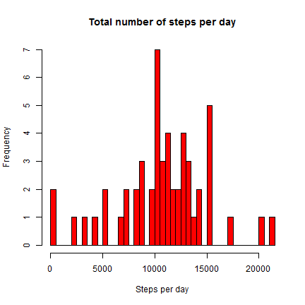
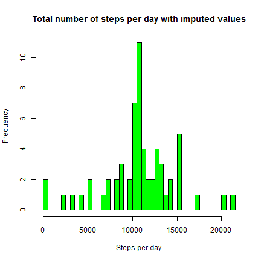

# Reproducible Research: Peer Assessment 1


## Loading and preprocessing the data


```r
# Unzip the data set
unzip("activity.zip")
```

```
## Error: cannot open file './activity.csv': Permission denied
```

```r

# Read the data
data <- read.csv("activity.csv")

# Get a summary
summary(data)
```

```
##      steps               date          interval   
##  Min.   :  0.0   2012-10-01:  288   Min.   :   0  
##  1st Qu.:  0.0   2012-10-02:  288   1st Qu.: 589  
##  Median :  0.0   2012-10-03:  288   Median :1178  
##  Mean   : 37.4   2012-10-04:  288   Mean   :1178  
##  3rd Qu.: 12.0   2012-10-05:  288   3rd Qu.:1766  
##  Max.   :806.0   2012-10-06:  288   Max.   :2355  
##  NA's   :2304    (Other)   :15840
```


## What is mean total number of steps taken per day?


```r
# Total number of steps taken per day
steps_per_day <- aggregate(steps ~ date, data = data, FUN = sum)
```


```r
# Histogram of the total number of steps taken per day
hist(steps_per_day$steps, breaks = nrow(steps_per_day), main = "Total number of steps per day", 
    xlab = "Steps per day", col = "red")
```

 


```r
# Calculate the mean and median total number of steps taken per day
mean_steps_per_day <- mean(steps_per_day$steps)
median_steps_per_day <- median(steps_per_day$steps)
```

The mean total number of steps taken per day is 10766  
The median total number of steps taken per day is 10765

## What is the average daily activity pattern?


```r
# The average number of steps taken per 5 minute interval is
average_per_interval <- aggregate(steps ~ interval, data = data, FUN = mean)
```


```r
# Make a time series plot of the 5-minute interval (x-axis) and the
# average number of steps taken, averaged across all days (y-axis)
plot(average_per_interval, type = "l", main = "Average Daily Activity Pattern", 
    xlab = "5-minute Intervals", ylab = "Average number of steps taken, averaged across all day")
```

 


```r
# Find 5-minute interval, on average across all the days in the dataset,
# that contains the maximum number of steps
max_interval <- average_per_interval[which.max(average_per_interval$steps), 
    "interval"]
```

The 5-minute interval, on average across all days in the dataset, that contains the maximum number of steps is 835


## Imputing missing values


```r
# Calculate and report the total number of missing values in the dataset
# (i.e. the total number of rows with NAs)
total_missing <- sum(is.na(data))
```

The total number of missing values in the dataset is 2304.  
  
The missing values will be filled by replacing NAs with the mean of the 5-minute interval averaged across all days.


```r

# NAs replaced by imputed value (mean of 5-minute interval) according to
# the procedure below
imputed_steps <- numeric()
for (i in 1:nrow(data)) {
    temp <- data[i, ]
    if (is.na(temp$steps)) {
        steps <- subset(average_per_interval, interval == temp$interval)$steps
    } else {
        steps <- temp$steps
    }
    imputed_steps <- c(imputed_steps, steps)
}

# The new dataset has the missing data filled in.
imputed_data <- data
imputed_data$steps <- imputed_steps

# The total number of steps taken per day is
imputed_steps_per_day <- aggregate(steps ~ date, data = imputed_data, FUN = sum)
```


```r
# Histogram of the total number of steps taken per day
hist(imputed_steps_per_day$steps, breaks = nrow(imputed_steps_per_day), main = "Total number of steps per day with imputed values", 
    xlab = "Steps per day", col = "green")
```

 


```r
# Calculate the mean and median total number of steps taken per day
imputed_mean_steps_per_day <- mean(imputed_steps_per_day$steps)
imputed_median_steps_per_day <- median(imputed_steps_per_day$steps)
```

The mean total number of steps taken per day is 10766  
The median total number of steps taken per day is 10766

After imputing the missing step values, the mean total number of steps per day remained unchanged and is equal to the median total number of steps per day, which increased from 10765 to 10766.

## Are there differences in activity patterns between weekdays and weekends?


```r
# Create a new factor variable in the dataset with two levels - 'weekday'
# and 'weekend' indicating whether a given date is a weekday or weekend
# day.

weekend_days <- c("Saturday", "Sunday")
imputed_data$daytype <- as.factor(sapply(as.Date(imputed_data$date), function(x) ifelse(weekdays(x) %in% 
    weekend_days, "weekend", "weekday")))
```


```r
# Make a panel plot containing a time series plot (i.e. type = 'l') of the
# 5-minute interval (x-axis) and the average number of steps taken,
# averaged across all weekday days or weekend days (y-axis).
require(plyr)
```

```
## Loading required package: plyr
```

```r
require(lattice)
```

```
## Loading required package: lattice
```

```r

average_steps <- ddply(imputed_data, .(interval, daytype), summarize, steps = mean(steps))

xyplot(steps ~ interval | daytype, data = average_steps, layout = c(1, 2), type = "l", 
    xlab = "5-minute Intervals", ylab = "Number of steps", main = "Activity patterns on weekends and weekdays")
```

 


